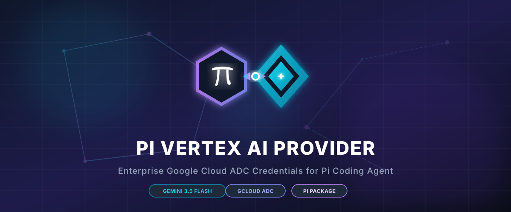

# pi-vertex-ai-provider

<p align="center">
  
</p>

Pi package/extension that makes Pi's built-in `google-vertex` provider use **Vertex AI Application Default Credentials (ADC)** instead of an API key, plus registers `gemini-3.5-flash` until Pi ships it built-in.

## Why extension, not a new provider?

Pi already ships an official `google-vertex` provider and model serializer for Gemini on Vertex AI, including streaming, tools/function calling, multimodal input, usage accounting, and thinking controls. This package keeps those built-in models, overrides provider auth/config so the official provider runs with Google Cloud ADC, and appends `gemini-3.5-flash`.

## Setup

```bash
# 1) Install/login Google Cloud CLI
 gcloud auth login
 gcloud auth application-default login

# 2) Select project and optional location
 gcloud config set project YOUR_PROJECT_ID
 # Optional; defaults to global
 set GOOGLE_CLOUD_LOCATION=global
```

You can also configure without changing gcloud defaults:

```bash
set PI_VERTEX_AI_PROJECT=YOUR_PROJECT_ID
set PI_VERTEX_AI_LOCATION=global
```

## Use with Pi

### 1. Installation (For End-Users)

To use this provider across your projects, install it using one of the following methods.

#### Global Installation (Recommended)
This makes the Vertex AI provider available globally in all projects:
```bash
# From npm
pi install npm:pi-vertex-ai-provider

# Directly from GitHub (always latest)
pi install git:github.com/AlyusLabs/pi-vertex-ai-provider
```

#### Project-Local Installation
If you only want this provider enabled in a specific project, run this inside that project's directory:
```bash
pi install -l git:github.com/AlyusLabs/pi-vertex-ai-provider
```

Once installed, simply run `pi` normally:
```bash
pi
```

---

### 2. Local Development & Testing (For Developers)

If you are making changes to this extension and want to test it on the fly, use the temporary extension flag (`-e`).

> ⚠️ **Important UX Note:** The `.` in `pi -e .` refers to the *current working directory*. 

#### Option A: Running from inside this repository
If you are currently inside this repository's directory, run:
```bash
cd pi-vertex-ai-provider
pi -e .
```

#### Option B: Testing from another project directory
If you are inside another project directory (e.g., your game folder) and want to test your local copy of this provider, you must specify the **absolute path** to this repository instead of `.`:
```bash
cd C:\Users\Yusuf\Desktop\My-Game-Project
pi -e C:\Users\Yusuf\Documents\pi-vertex-ai-provider
```

---

### 3. Selecting the Vertex Models

Then select a Vertex model such as:

```text
google-vertex/gemini-3.5-flash
google-vertex/gemini-3-pro-preview
google-vertex/gemini-2.5-pro
google-vertex/gemini-2.5-flash
```

`gemini-3.5-flash` is registered with a 1,048,576-token context window, 65,536 max output tokens, thinking enabled, and base-tier Vertex pricing in Pi's usage display.

## Check status

Inside Pi:

```text
/vertex-ai-status
```

## Environment variables

- `PI_VERTEX_AI_PROJECT` - preferred project override.
- `PI_VERTEX_AI_LOCATION` - preferred location override; defaults to `global`.
- `PI_VERTEX_AI_FORCE_ADC=0` - do **not** force-disable `GOOGLE_CLOUD_API_KEY`.

By default, the extension sets Pi's Vertex API-key marker (`gcp-vertex-credentials`) so Pi uses ADC/gcloud credentials, not API keys.
